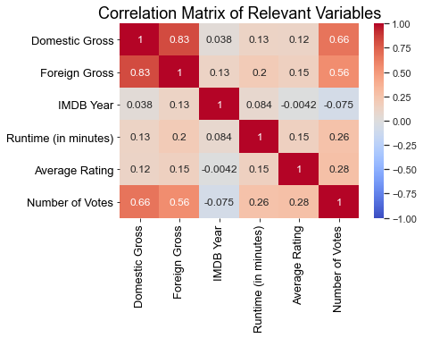
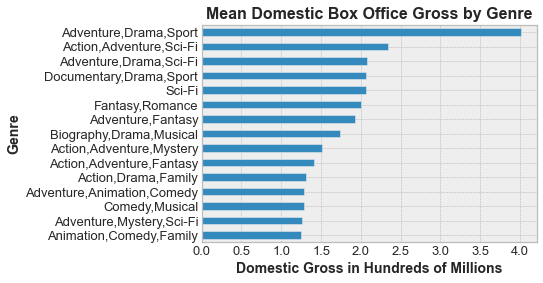
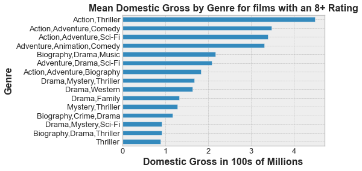
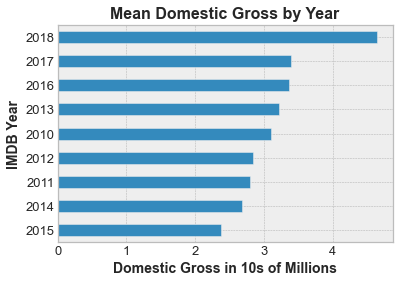
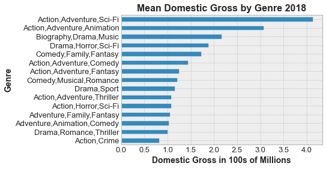
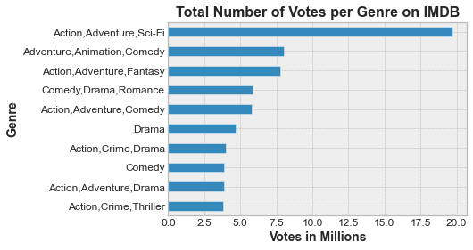
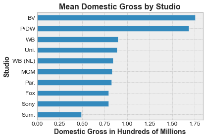
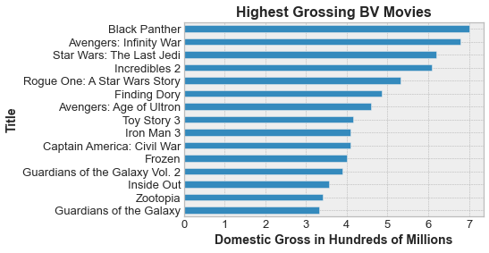
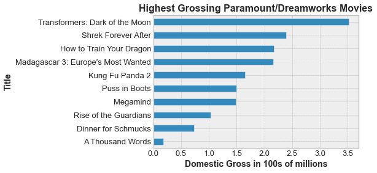
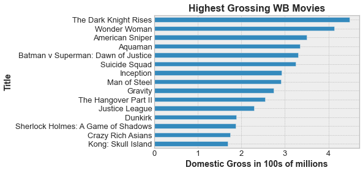

# Flatiron Data Science Phase 1 Project README

## **Author:** Madeleine Reiser
***

## Overview

This project used exploratory data analysis to help the business stake owners of a potential new movie streaming service figure out the best ways to make box office revenue. Datasets from IMDB and Box Office Mojo were analyzed to show what movies have made the most money, which are the highest rated, and which are the most popular, from the years 2010-2018. 

## Business Problem

Microsoft Stake Owners are interested in developing their own streaming service but aren’t sure what kinds of movies do the best in the box office. 

## Data Understanding

Using datasets from IMDB and Box Office Mojo, this project explores how box office revenue is correlated with variables such as ratings, popularity (which is measured by number of reviews left by viewers), specific studios and genres.  

## IMDB Ratings Dataset

Contains "tconst", which appears to be the code for each movie, the film's average rating, and the number of votes on IMDB

## IMDB Basic Dataset

Contains more information for each film on IMDB including "tconst" again, Primary and Original titles, start year, runtime in minutes, and the genre. 

## Box Office Mojo dataset

Contains the title, studio, domestic gross, foreign gross and year released according to data from Box Office Mojo 

## Data Modeling Results

I first created a correlation matrix to see which variables have a relationship with "Domestic Gross" or "Foreign Gross" 

### Notable Correlations:

Domestic Gross & Foreign Gross have a strong positive correlation of .83. This indicates that films that do well in the Domestic Box Office will do well in the Foreign Box Office.

Number of Votes & Domestic Gross have a moderate-strong positive correlation of .66. This means that more votes on IMDB tend to lead to a higher Domestic revenue.

The correlation between Number of Votes & Foreign Gross is a little weaker, at .56, but still notable.

Finally, Average Rating and Number of Votes have a mild positive correlation of .28, meaning that films with a higher rating can bring in more votes, or vice versa.
    

    

This graph represents the mean Domestic Gross of the highest-grossing genres from 2010-2018. Adventure/Drama/Sport films blew the rest out of the water and made the most money at $400,700,000.
 

    

"Mean Domestic Gross by Genre for films with an 8+ Rating" displays that the average Domestic Gross for Action/Thriller movies with a high rating was $448,100,000.
    

    

"Mean Domestic Gross by Year" depicted the average Domestic Gross a film made for each year from 2010-2018. The year 2018 had the highest average Domestic Gross of $46,349,360. This number seemed low compared to the other graphs, but that's because the average was affected by low-grossing films.
    

    

"Mean Domestic Gross by Genre 2018" shows the average Domestic Gross a film from a certain genre(s) made in the year 2018. Again, Action/Adventure/Sci-fi makes the highest grossing films on average with a Domestic Gross of $412,300,000.
    

    

I was interested in exploring which genres had the most movies with a "high rating", meaning an 8 or better on IMDB. The bar graph "Number of Movies per Genre with a rating of 8+ on IMDB" shows that Documentaries have the most movies with a rating of 8+ at 2715 films.
   

    

Because of the strong positive correlation between Number of Votes and Domestic Box Office Gross, I decided to explore which genres garnered the most votes. Again, Action/Adventure/Sci-fi had a giant lead with a total of 19,721,992 votes. Adventure/Animation/Comedy had 8,037,681 votes, and Action/Adventure/Comedy had 7,763,568.
    

    

I was interested in which production studios had the highest Domestic Box Office revenue, and which of their movies did best. I took the mean Domestic Gross for each studio rather than the sum, because an individual studio might not make many movies, or have a couple that did well. This gives a better idea of how much an individual film might make.

"Mean Domestic Gross by Studio" determined that BV, P/DW and WB made the most money per film on average in the Domestic Box Office.

BV: $ 175,240,200

P/DW: $ 168,290,000

WB: $ 89,799,160

    

    

The 5 Highest Grossing BV movies are:

    Black Panther:                  $700,100,000
    Avengers: Infinity War:         $678,800,000 
    Star Wars: The Last Jedi:       $620,200,000 
    Incredibles 2:                  $608,600,000 
    Rogue One: A Star Wars Story    $532,200,000

    

The 5 Highest Grossing P/DW movies are:

    Transformers: Dark of the Moon:        $352,400,000
    Shrek Forever After:                   $238,700,000 
    How to Train Your Dragon:              $217,600,000 
    Madagascar 3: Europe's Most Wanted:    $216,400,000 
    Kung Fu Panda 2:                       $165,200,000

    

The 5 Highest Grossing WB movies are:

    The Dark Knight Rises:              $448,100,000
    Wonder Woman:                       $412,600,000 
    American Sniper:                    $350,100,000 
    Aquaman:                            $335,100,000 
    Batman v Superman: Dawn of Justice: $330,400,000
    

    

## Conclusions

Action/Adventure/Sci-fi films that are part of a franchise or has sequels make the most money in the Domestic Box Office. I would recommend Microsoft invest in a comic book series similar to Marvel or DC.

Action/Adventure/Animation films are the second-highest grossing genre, and those with sequels do the best. Dreamworks/Paramount does the best with this genre by making children's animated films.

Because Documentaries are the highest rated genre. I would recommend Microsoft invest in these as well, for recognition and awards. 

In the future, data from 2019 onward would be interesting to look at to see how the film industry was affected by the Covid-19 Pandemic and how they adapted. 
